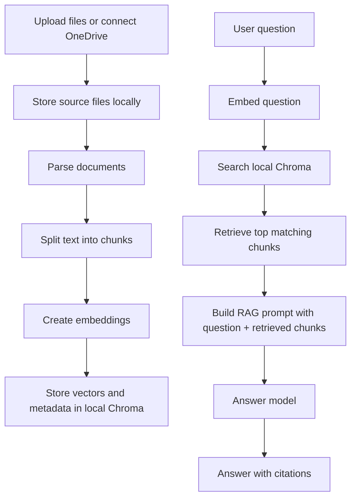
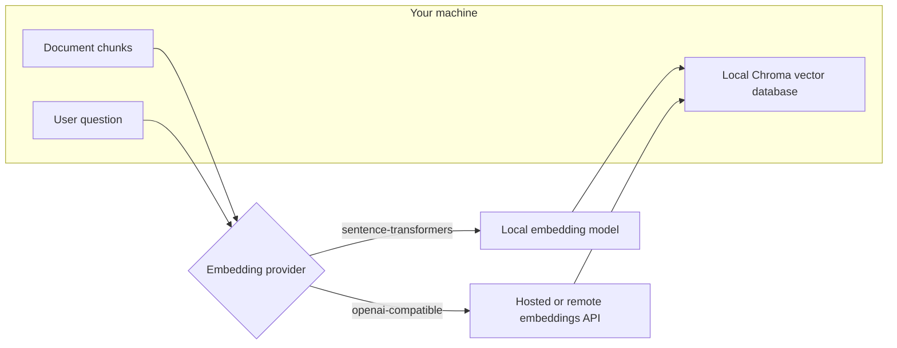
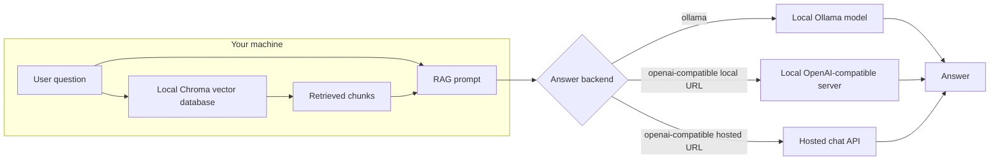

# Configurable RAG Workflow

This project is a RAG app for chatting with uploaded documents or OneDrive documents. It can run fully local, or it can offload embeddings and/or answer generation to hosted OpenAI-compatible APIs when local compute is limited.

Local components:

- Document parsing and chunking.
- Vector storage through a local Chroma database.
- Uploaded and downloaded source files.

Configurable components:

- Embeddings: hosted OpenAI-compatible `/embeddings` by default, or local `sentence-transformers`.
- Chat generation: local Ollama or hosted/local OpenAI-compatible `/chat/completions`.

Privacy boundary:

- Local embeddings + local chat: document text stays on this machine, except for OneDrive/Microsoft Graph access if you use that connector.
- Hosted embeddings: every indexed document chunk is sent to the embedding provider.
- Hosted chat: only the retrieved chunks for each question are sent to the chat provider, not the whole corpus.
- OneDrive Graph: files are downloaded from your OneDrive into this machine before indexing. If you use the locally synced OneDrive folder option, no Graph connection is needed.

Important: when changing embedding provider or embedding model, re-index your documents so the stored vectors match the selected model. Different embedding models usually produce incompatible vectors.

If Chroma reports an embedding function conflict after switching providers, remove any manual `RAG_COLLECTION` override or change it to a fresh value, then index the documents again. Deleting chunks from a collection does not always remove the collection's stored embedding configuration.

## Architecture

The app has two separate phases: indexing and answering. Indexing prepares documents for retrieval. Answering retrieves relevant chunks and sends only those chunks to the answer model.

### End-To-End RAG Flow



### Embedding Path

Embeddings are used twice: once when indexing document chunks, and once when embedding the user question for retrieval.



If you choose `sentence-transformers`, document chunks and questions are embedded on your machine. This uses more local CPU/RAM, but the text does not leave your machine for embeddings.

If you choose `openai-compatible`, document chunks and questions are sent to the configured embeddings endpoint. This reduces local compute, but it means every indexed chunk is shared with that provider during indexing.

### Answer Model Path

The answer model receives the user question plus the retrieved chunks. It does not receive the full document collection unless the retrieved chunks cover it.



If you choose `ollama`, the retrieved chunks stay on your machine and the answer is generated locally.

If you choose a local OpenAI-compatible server, such as LM Studio, vLLM, or llama.cpp server on `localhost`, the retrieved chunks stay on your machine.

If you choose a hosted OpenAI-compatible chat endpoint, only the question, chat history selected in the UI, system prompt, and retrieved chunks are sent to that provider.

### Data Movement Matrix

| Configuration | During indexing | During chat |
| --- | --- | --- |
| Local embeddings + local answer model | Documents stay local | Retrieved chunks stay local |
| Local embeddings + hosted answer model | Documents stay local | Retrieved chunks are sent to hosted chat API |
| Hosted embeddings + local answer model | Every indexed chunk is sent to hosted embeddings API | Retrieved chunks stay local |
| Hosted embeddings + hosted answer model | Every indexed chunk is sent to hosted embeddings API | Retrieved chunks are sent to hosted chat API |

## Quick Start

1. Install Python 3.10 or newer.
2. Install dependencies:

   ```powershell
   python -m venv .venv
   .\.venv\Scripts\Activate.ps1
   pip install -r requirements.txt
   ```

3. Start the app:

   ```powershell
   .\.venv\Scripts\Activate.ps1
   streamlit run app.py
   ```

4. Open the URL printed by Streamlit, upload documents or ingest a OneDrive folder, build the index, and chat.

## Deploy To Streamlit Community Cloud

Actual deployment requires your Streamlit and GitHub account authorization. This repository is prepared for Streamlit Cloud with:

- [requirements.txt](requirements.txt)
- [runtime.txt](runtime.txt)
- [.streamlit/config.toml](.streamlit/config.toml)
- [.streamlit/secrets.toml.example](.streamlit/secrets.toml.example)

Deployment steps:

1. Create a GitHub repository and push this project.
2. Open [Streamlit Community Cloud](https://share.streamlit.io/).
3. Create a new app from the GitHub repository.
4. Set the main file path to `app.py`.
5. Open the app settings and paste the values from `.streamlit/secrets.toml.example` into Streamlit's `Secrets` editor.
6. Fill in real API keys for hosted embeddings/chat before deploying.

For Streamlit Cloud, use hosted `openai-compatible` embeddings and hosted `openai-compatible` chat. Ollama will not be available unless you point the app to a reachable remote Ollama-compatible service.

Important deployment limitation: Streamlit Community Cloud storage is not durable like a database. Uploaded files, Chroma indexes, and chat history are stored under `.rag_data/` and may be lost when the app restarts or redeploys. For production, replace local Chroma/file storage with durable storage such as a managed vector database and object storage.

The top-right Streamlit deploy toolbar is hidden with `.streamlit/config.toml` and app-level CSS.

## Cloud-Assisted Setup

Use this when your machine does not have enough compute for local embeddings and/or local LLM inference.

### Hosted Chat Only

This keeps document parsing, chunking, embeddings, and the vector database local. For each question, the app sends only the retrieved chunks to the hosted chat model.

Sidebar settings:

```text
Embedding provider: sentence-transformers
Backend: openai-compatible
Chat base URL: https://api.openai.com/v1
Chat model: gpt-4o-mini
API key: <your key>
Allow non-local chat endpoint: checked
```

### Hosted Embeddings And Hosted Chat

This uses much less local compute. During indexing, every chunk is sent to the embedding endpoint. During chat, retrieved chunks are sent to the chat endpoint.

Sidebar settings:

```text
Embedding provider: openai-compatible
Embeddings base URL: https://api.openai.com/v1
Embedding model: text-embedding-3-small
Embedding API key: <your key>
Allow non-local embedding endpoint: checked

Backend: openai-compatible
Chat base URL: https://api.openai.com/v1
Chat model: gpt-4o-mini
API key: <your key>
Allow non-local chat endpoint: checked
```

The OpenAI-compatible settings also work with many gateways and self-hosted servers. Use the provider's base URL ending in `/v1` when available.

## Supported Inputs

- PDF: `.pdf`
- Word: `.docx`
- Text and Markdown: `.txt`, `.md`
- HTML: `.html`, `.htm`
- JSON: `.json`
- CSV and Excel: `.csv`, `.xlsx`, `.xls`

## Chat History

The left sidebar includes a `Recents` list similar to ChatGPT. Use it to:

- Switch between separate conversations.
- Create a new chat.
- Open the current chat options.
- Rename, clear, or delete the current chat.

Chat sessions are saved locally in:

```text
.rag_data/chat_history.json
```

The message box is rendered after the conversation messages so it stays at the end of the active chat.

## Parameters Exposed in the UI

The sidebar exposes the main setup parameters:

- Storage: handled automatically with optional `.env` overrides.
- Embeddings: provider, model, base URL, API key, remote-endpoint permission.
- Chunking: chunk size, overlap, minimum chunk length.
- Retrieval: number of chunks, distance threshold, source deduplication.
- Prompting: system prompt, answer prompt template, citation behavior.
- LLM backend: Ollama or OpenAI-compatible endpoint.
- Generation: temperature, top-p, top-k, context window, max output tokens, repeat penalty, seed, stop sequences.
- OneDrive: synced folder path, or Microsoft Graph client ID, tenant ID, remote path, file limits, and extensions.

## Parameter Reference

### Storage

Storage is handled automatically and is not shown in the app UI.

- Source files are stored in `.rag_data/documents` by default.
- Chroma vectors are stored in `.rag_data/chroma` by default.
- The collection name is generated from the selected embedding provider and model so switching embedding setup does not usually create a Chroma conflict.
- Advanced users can override these with `RAG_DATA_DIR`, `RAG_CHROMA_DIR`, and `RAG_COLLECTION` in `.env`.

### Embeddings

- `Embedding provider`: converts document chunks and questions into vectors.
- `openai-compatible`: hosted or remote embeddings. This is the default because it reduces local compute, but sends indexed chunks to that endpoint.
- `sentence-transformers`: local embeddings. This is slower on low-powered machines, but document chunks stay local.
- `Sentence-transformers model`: local embedding model, for example `sentence-transformers/all-MiniLM-L6-v2`.
- `Embeddings base URL`: API base URL for remote embeddings, for example `https://api.openai.com/v1`.
- `Embedding model`: remote embedding model, for example `text-embedding-3-small`.
- `Embedding API key`: key for the embedding provider.
- `Allow non-local embedding endpoint`: must be checked before document chunks can be sent to a remote embedding API.
- `Vector distance metric`: how similarity is measured. `cosine` is the safest default for most embedding models. `l2` uses Euclidean distance. `ip` uses inner product.

### Chunking

- `Chunk size`: maximum characters per document chunk. Larger chunks preserve more context, but can reduce retrieval precision.
- `Chunk overlap`: repeated characters between neighboring chunks. This helps avoid losing context at chunk boundaries.
- `Minimum chunk length`: skips tiny chunks that are usually not useful.
- `Replace existing chunks for same source`: re-indexing a file removes its older chunks first.

### Retrieval

- `Retrieved chunks`: how many chunks are fetched for each question.
- `Use distance threshold`: filters out weak matches.
- `Maximum distance`: lower is stricter for `cosine` and `l2`; too low may return no context.
- `Return at most one chunk per source`: prevents one file from dominating the retrieved context.
- `Max context characters`: maximum retrieved text sent to the chat model.

### Prompting

- `System prompt`: high-level behavior instruction for the answer model.
- `RAG prompt template`: template that combines `{context}` and `{question}` before sending to the model.
- `Show retrieved citations`: displays which chunks were used for an answer.
- `Chat history turns sent to model`: how many previous conversation turns are included.

### Answer Model

- `Backend`: chooses the answer model API.
- `openai-compatible`: hosted OpenAI-compatible API, or a local LM Studio, vLLM, or llama.cpp server.
- `ollama`: local Ollama server.
- `Chat base URL`: API base URL for chat completions.
- `Chat model`: model used to answer, for example `gpt-4o-mini`.
- `API key`: key for hosted chat provider.
- `Allow non-local chat endpoint`: must be checked before retrieved chunks are sent to a remote chat API.
- `Ollama host`: local Ollama URL, usually `http://localhost:11434`.
- `Ollama model`: local model name, for example `llama3:latest`.

### Generation

- `Temperature`: controls randomness. Lower is more deterministic.
- `Top-p`: nucleus sampling. Lower narrows token choices.
- `Top-k`: Ollama-specific limit on candidate tokens.
- `Repeat penalty`: discourages repetition.
- `Context window`: Ollama context capacity.
- `Max output tokens`: maximum answer length.
- `Seed`: fixed seed for repeatable outputs; blank means random.
- `Stop sequences`: comma-separated strings where generation should stop.

### OneDrive

- `Synced OneDrive folder path`: indexes files already synced to your machine.
- `Client ID`: Microsoft Entra app registration ID for Graph access.
- `Tenant ID`: usually `common`, or your organization tenant ID.
- `Remote folder path in OneDrive`: OneDrive folder to download from.
- `Maximum files to download`: safety limit for Graph downloads.
- `File extensions`: document types to fetch and index.

## OneDrive Options

### Local Synced Folder

Use the OneDrive desktop client, then point the app at a local folder such as:

```text
C:\Users\<you>\OneDrive\Research
```

This is the simplest and most private option because the app only reads local files.

### Microsoft Graph Connector

For remote OneDrive access:

1. Register a public client app in Microsoft Entra ID.
2. Allow public client flows.
3. Add delegated permissions: `User.Read`, `Files.Read`, `offline_access`.
4. Put the client ID and tenant ID into the sidebar or `.env`.
5. Use the OneDrive Graph section in the app to sign in with a device code and download files locally.

## Local Backends

### Ollama

If you want to keep generation local:

```text
http://localhost:11434
model: llama3:latest
```

### Local OpenAI-Compatible Server

Use this for LM Studio, llama.cpp server, vLLM running locally, or another local endpoint:

```text
http://localhost:1234/v1
```

Remote chat and remote embedding endpoints are blocked by default. If you intentionally use a non-local endpoint, enable the matching checkbox in the UI.

## Data Locations

By default, local files and indexes are stored under:

```text
.rag_data/
```

Do not commit this directory if you later turn this into a git repo.
